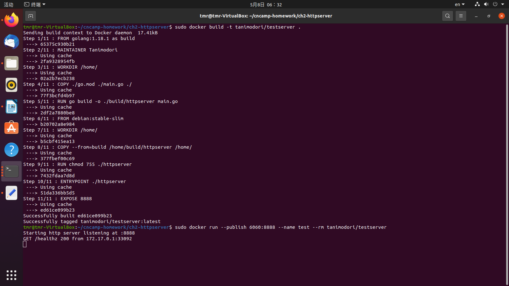
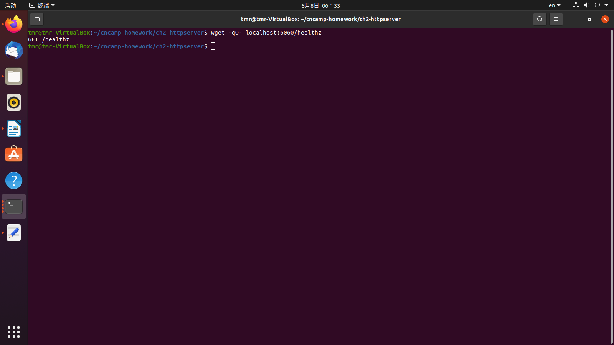
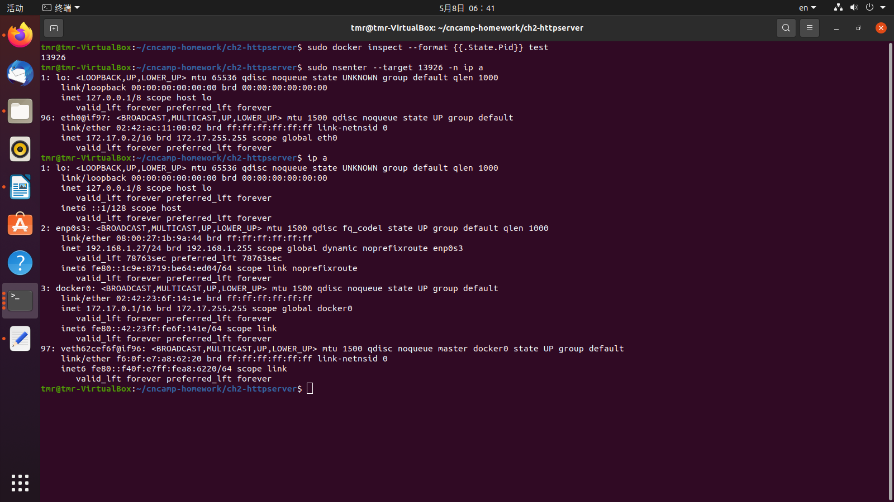
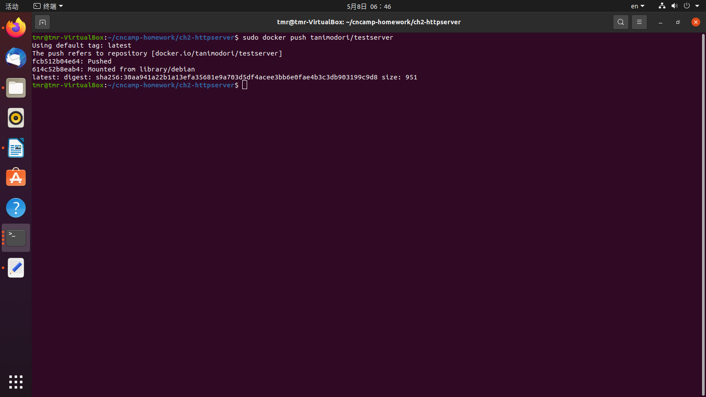

# Ch3. Dockerfile

## Build image

```bash
sudo docker build -t tanimodori/testserver .
```

## Run image

```bash
sudo docker run --publish 8080:8080 --name test --rm tanimodori/testserver
```



## Visit image

```bash
wget -qO- localhost:8080/healthz
```



# Show image network

```bash
sudo docker inspect --format {{.State.Pid}} test
sudo nsenter --target <PID> -n ip a
ip a
```



## Publish image

```bash
sudo docker push tanimodori/testserver
```

